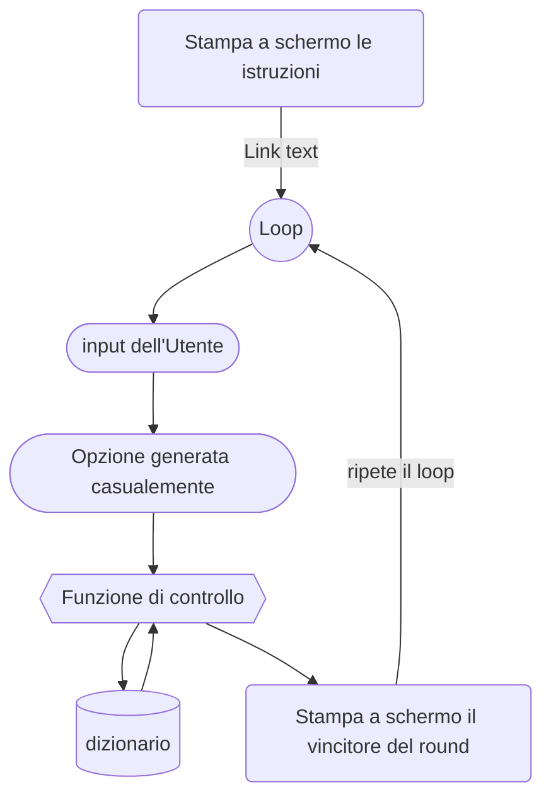

# Carta forbice sasso

Come primo esercizio ho pensato di farvi ricreare un gioco che tutti dovreste conoscere molto bene.

Per scrivere il codice basta seguire passo passo le indicazioni all'interno di questo file, per qualsiasi dubbio non abbiate paura di fare domande o chiedere chiarimenti.

## Progettazione

Prima di qualsiasi altra cosa è importante avere in mente un idea di come sarà strutturato il nostro programma.

Per iniziare scriviamo un elenco delle **features** che vogliamo implementare nel nostro programma:
- L'utente deve essere in grado di scegliere tra `Carta`, `Forbice` e `Sasso`
- Il programma deve generare **casualmente** una scelta
- La scelta del **programma** deve essere confrontata con quella dell'**utente**
- Si vince al meglio delle 3

---
All'interno del codice dovremo quindi scrivere una funzione che come argomenti prende la scelta dell'utente e la scelta generata dal programma e tramite un dizionario decide chi debba essere il vincitore. La funzione deve essere inserita all'interno di un loop che ciclerà per 3 volte *(Per ora non teniamo in considerazione 2 vittorie di seguito come vittoria)* e al termine del loop verrà decretato il vincitore quindi il programma sarà strutturato più o meno in questo modo:

## Code

Iniziamo a scrivere il nostro programma, prima di iniziare assicurati di aver installato python, in caso tu non lo abbia fatto basta cercare come fare su youtube per trovare migliaia di tutorial.

Creiamo un nuovo file chiamato `main.py`, per eseguire il nostro file ci basterà premere il piccolo bottone play oppure digitare a riga di comando `python3 main.py` e il file si eseguirà.

Apriamo il file ed iniziamo a scrivere il codice che stamperà le informazioni sullo schermo.
> Nota: ti ricordo che per stampare qualcosa sullo schermo si usa la funzione `print()`

    print("Carta forbice sasso") # Stampiamo il titolo
    print("Inserisci il numero corrispondente alla tua scelta !") # Spieghiamo come si gioca
    
    # Stampiamo a schermo le opzioni
    print("[1] -> Carta")
    print("[2] -> Forbice")
    print("[3] -> Sasso")

Bene, ora è arrivato il momento di entrare nel nostro **loop**, per ora non preoccupiamoci di quante volte viene eseguito il loop... facciamo andare all'infinito... quindi usiamo un ciclo `while` all'interno del quale andremo a salvare in una **variabile** l'input dell'utente.
> Nota: per ottenere l'imput dell'utente è necessario usare la funzione `input()`

	while True:
		user_option = input('Inserisci un numero da 1 a 3')
		
Ora dobbiamo generare una scelta casuale e per farlo useremo una libreria chiamata `random` che ci fornisce una funzione chiamata `randrange()` per generare un numero casuale in un range dato.
Per importare la libreria all'interno del nostro file saliamo in cima al codice e digitiamo:

	from random import randrange 
	# dalla libreria importa la funzione che ci serve

Ora il codice dovrebbe essere più o meno così:

	from random import randrange 
	# dalla libreria importa la funzione che ci serve

    print("Carta forbice sasso") # Stampiamo il titolo
    print("Inserisci il numero corrispondente alla tua scelta !") # Spieghiamo come si gioca
    
    # Stampiamo a schermo le opzioni
    print("[1] -> Carta")
    print("[2] -> Forbice")
    print("[3] -> Sasso")

	while True:
		user_option = input('Inserisci un numero da 1 a 3')

Fuori dal loop creiamo il dizionario che la nostra funzione dovrà utilizzare per decidere chi ha vinto il round.
All'interno del dizionario andiamo a scrivere tutte le opzioni possibile con i numeri che abbiamo usato precedentemente *(Non è il modo migliore di farlo però dovrebbe essere abbastanza semplice per iniziare)*

	dictionary = {
	'1-1': None,
	'2-2': None,
	'3-3': None,

	'1-2': 'B',
	'1-3': 'A',

	'2-3': 'B',
	'2-1': 'A',

	'3-1': 'B',
	'3-2': 'A',
	}

Procediamo scrivendo fuori dal nostro loop la funzione che controlla chi vince con i seguenti punti:

- Definiamo la funzione dandogli un nome esplicativo come ad esempio **check**

		def check(a, b):
		
	> Nota: La funzione riceverà 2 variabili: a -> la scelta dell'utente, b -> la scelta generata casualmente

- Creiamo la nostra variabile **winner** = a l'output del dizionario che abbiamo creato in precedenza

		def check(a, b):
			winner = dictionary[f"{a}-{b}"]

	> Nota: utilizzando la lettera **f** prima di una stringa ci permette di inserire il contenuto di una variabile all'interno del testo. Per farlo basta utilizzare le parentesi graffe attorno alla variabile

- Ora facciamo si che la nostra funzione restituisca il vincitore
	
		def check(a, b):
			winner = dictionary[f"{a}-{b}"]
			return winner

Ora in codice dovrebbe essere più o meno così:

	from random import randrange 
	# dalla libreria importa la funzione che ci serve

    print("Carta forbice sasso") # Stampiamo il titolo
    print("Inserisci il numero corrispondente alla tua scelta !") # Spieghiamo come si gioca
    
    # Stampiamo a schermo le opzioni
    print("[1] -> Carta")
    print("[2] -> Forbice")
    print("[3] -> Sasso")

	# Dizionario contenente tutte le opzioni
	dictionary = {
	'1-1': None,
	'2-2': None,
	'3-3': None,

	'1-2': 'B',
	'1-3': 'A',

	'2-3': 'B',
	'2-1': 'A',

	'3-1': 'B',
	'3-2': 'A',
	}

	# Questa funzione prende due argomenti e restituisce il vincitore
	def check(a, b): 
		winner = dictionary[f"{a}-{b}"]
		return winner

	# Loop infinito
	while True: 
		user_option = input('Inserisci un numero da 1 a 3')

Torniamo a lavorare all'interno del nostro loop, è arrivato il momento di generare una scelta casuale.
Per farlo creiamo la variabile `bot_option` e la poniamo uguale all'output della funzione `randrange()` che abbiamo importato in precedenza passando come argomenti il range nel quale deve trovarsi il numero generato

	bot_option = randrange(1, 4)

Creiamo la variabile `round_winner` = all'output della nostra funzione passando come argomenti la scelta dell'utente e la scelta appena generata casualmente

	round_winner = check(user_option, bot_option)

Aggiungiamo un **if** per controllare se ci troviamo in un caso di parità e stampiamo a schermo il vincitore

	if not round_winner:
		print("Parità !")
	elif round_winner == 'A':
		print('Hai vinto il round !')
	elif round_winner == 'B':
		print('Hai perso il round T.T')

Ora il codice dovrebbe essere più o meno così:

	from random import randrange 
	# dalla libreria importa la funzione che ci serve

    print("Carta forbice sasso") # Stampiamo il titolo
    print("Inserisci il numero corrispondente alla tua scelta !") # Spieghiamo come si gioca
    
    # Stampiamo a schermo le opzioni
    print("[1] -> Carta")
    print("[2] -> Forbice")
    print("[3] -> Sasso")

	# Dizionario contenente tutte le opzioni
	dictionary = {
	'1-1': None,
	'2-2': None,
	'3-3': None,

	'1-2': 'B',
	'1-3': 'A',

	'2-3': 'B',
	'2-1': 'A',

	'3-1': 'B',
	'3-2': 'A',
	}

	# Questa funzione prende due argomenti e restituisce il vincitore
	def check(a, b): 
		winner = dictionary[f"{a}-{b}"]
		return winner

	# Loop infinito
	while True: 
		user_option = input('Inserisci un numero da 1 a 3')
		bot_option = randrange(1, 4)

		round_winner = check(user_option, bot_option)
		if not round_winner:
			print("Parità !")
		elif round_winner == 'A':
			print('Hai vinto il round !')
		elif round_winner == 'B':
			print('Hai perso il round T.T')

Bene, in questo momento puoi già provare il codice.
Abbiamo quasi finito, bisogna solo risolvere un ultimo piccolo problema.. Il programma va all'infinito
Per risolvere questo problema dobbiamo inserire una variabile per contare le vittorie.

Creiamo la variabile `wins` fuori dal ciclo e poniamola uguale a una tupla.

	wins = (0, 0)

Ora andiamo a modificare il codice scritto in precedenza per far si che ogni volta che qualcune vince venga aggiornato il punteggio *(dobbiamo andare a lavorae sull'if all'interno del loop)*

	if not round_winner:
		print("Parità !")
	elif round_winner == 'A':
		print('Hai vinto il round !')
		wins = (wins[0] + 1, wins[1]) # <----------- Modifica --------------
	elif round_winner == 'B':
		print('Hai perso il round T.T')
		wins = (wins[0], wins[1] + 1) # <----------- Modifica --------------

Perfetto, ora dobbiamo modificare il nostro loop, passiamo da un ciclo **while** ad un ciclo **for**  con solo 3 iterazioni e all'inizio di ogni iterazione scriviamo il numero del round.

	for  interaction  in  range(3):
		print(f"Siamo al {interaction+1} round !")

Fuori dal loop controlliamo il punteggio e stampiamo a schermo il vincitore e avremo finito.

	if  wins[0] == wins[1]:
		print('Wow, siete pari !')
	elif  wins[0] > wins[1]:
		print('Bravo, hai vinto !')
	else:
		print('Mi dispiace... hai perso.. Sono troppo forte :P')

Ecco il codice completo:

	from random import randrange 
	# dalla libreria importa la funzione che ci serve

    print("Carta forbice sasso") # Stampiamo il titolo
    print("Inserisci il numero corrispondente alla tua scelta !") # Spieghiamo come si gioca
    
    # Stampiamo a schermo le opzioni
    print("[1] -> Carta")
    print("[2] -> Forbice")
    print("[3] -> Sasso")

	# Dizionario contenente tutte le opzioni
	dictionary = {
	'1-1': None,
	'2-2': None,
	'3-3': None,

	'1-2': 'B',
	'1-3': 'A',

	'2-3': 'B',
	'2-1': 'A',

	'3-1': 'B',
	'3-2': 'A',
	}

	# Questa funzione prende due argomenti e restituisce il vincitore
	def check(a, b): 
		winner = dictionary[f"{a}-{b}"]
		return winner
	
	# Definiamo il punteggio
	wins = (0, 0) 
	
	# Loop con 3 interazioni	
	for  interaction  in  range(3):
		print(f"Siamo al {interaction+1} round !")
		
		user_option = input('Inserisci un numero da 1 a 3')
		bot_option = randrange(1, 4)

		round_winner = check(user_option, bot_option)
		if not round_winner:
			print("Parità !")
		elif round_winner == 'A':
			print('Hai vinto il round !')

			# Modifichiamo il punteggio
			wins = (wins[0] + 1, wins[1])
			
		elif round_winner == 'B':
			print('Hai perso il round T.T')
			
			# Modifichiamo il punteggio
			wins = (wins[0], wins[1] + 1)

	if  wins[0] == wins[1]:
		print('Wow, siete pari !')
	elif  wins[0] > wins[1]:
		print('Bravo, hai vinto !')
	else:
		print('Mi dispiace... hai perso.. Sono troppo forte :P')

Non resta altro che eseguire il codice !

Questo programma è veramente semplice e potrebbero essere fatte un sacco di migliorie, se te la senti prova a fare qualche cambiamento :)
